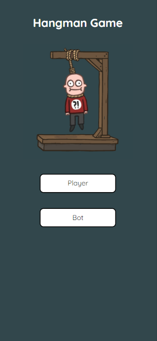
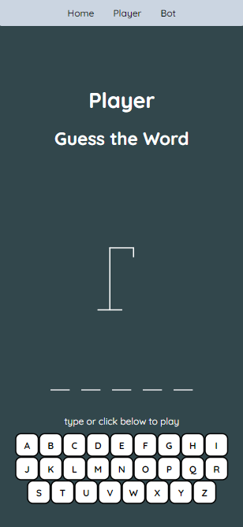

<!-- PROJECT LOGO -->
<br />
<div>
  <div align="center">
    <h1 style="font-weight: bold">TikTok Web Development Bootcamp</h1>
      <div>
        <h2>Desktop</h2>
        
        
      </div>
      <div>
        <h2>Mobile (iPhone XR)</h2>
        
        
      </div>
    <br />
    <br />
    <p align="center">
        This is an React web application is a hangman game fetches data from <a href="https://wordnik.com/">wordnik</a>, allowing a randomised word pool every round. There is also a feature where you can allow a bot to play for you. This application is responsive and fits any device screens.
        <br />
        <a href="https://github.com/ScorpiusSigma/TiktokBootCamp2022/issues">Report Bugs</a>
        ·
        <a href="https://github.com/ScorpiusSigma/TiktokBootCamp2022/issues">Request Feature</a>
    </p>

  </div>
</div>

<!-- TABLE OF CONTENTS -->

## Table of Contents

- [Table of Contents](#table-of-contents)
- [About The Project](#about-the-project)
- [Built-with](#built-with)
- [Getting Started](#getting-started)

<br />

<!-- ABOUT THE PROJECT -->

## About The Project

This is an React web application is a hangman game fetches data from <a href="https://wordnik.com/">wordnik</a>, allowing a randomised word pool every round. There is also a feature where you can allow a bot to play for you. This application is responsive and fits any device screens.

<br />

## Built-with

- [React](https://reactjs.org/)
- [tailwindcss](https://tailwindcss.com/)
- [axios](https://axios-http.com/)

<br />

<!-- GETTING STARTED -->

## Getting Started

This is an example of how you can set up your project locally. To get a local copy up and running follow these simple example steps.

1. Clone the repo with any

```sh
git clone with HTTPS          https://github.com/ScorpiusSigma/TiktokBootCamp2022.git
git clone with SSH            git@github.com:ScorpiusSigma/TiktokBootCamp2022.git
git clone with Github CLI     gh repo clone ScorpiusSigma/TiktokBootCamp2022
```

2. Development

```sh
1. Open the project in your preferred editor
2. npm install
3. npm start
```
